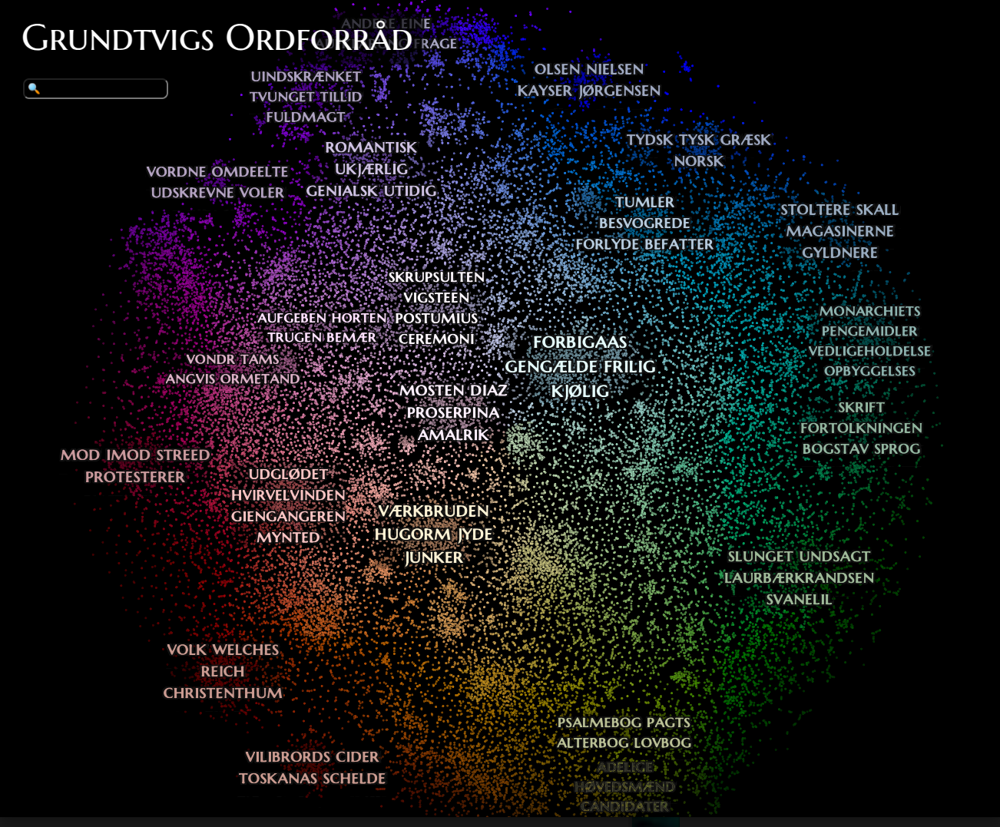

# grundtvig-map
A Semantic map over all of Grundtvig's word use.



## Usage

Install dependencies:
```bash
pip install -r requirements.txt
```

Download data and train word embeddings:
```python
python3 src/train_model.py
```
Produce map:
```python
python3 src/produce_graph.py
```

This outputs a graph to `figure/grundtvigs_ordforraad.html`
